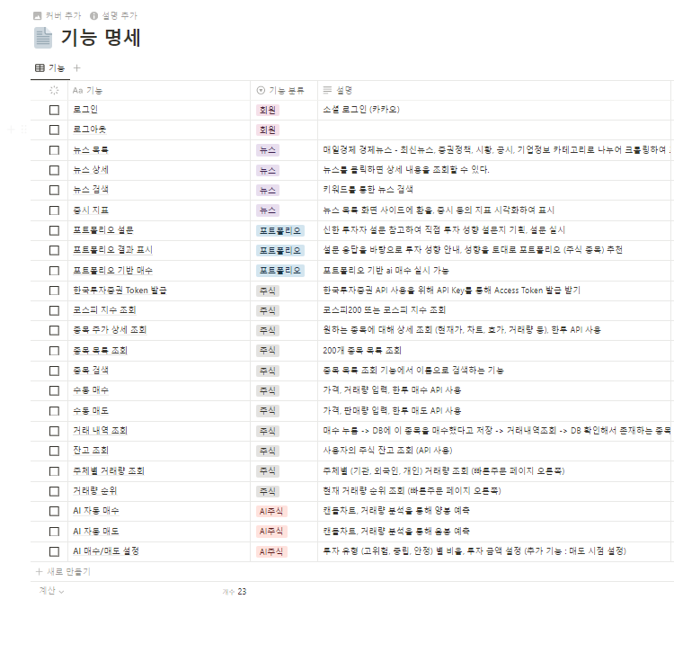
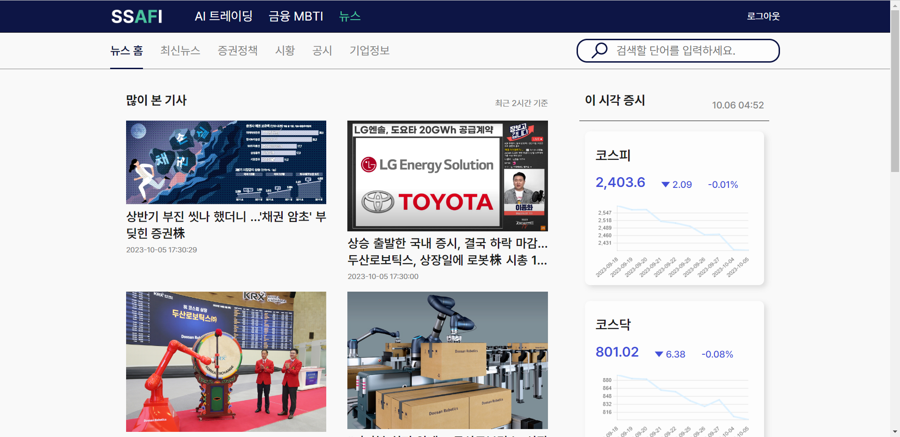

# SSAFI (Smart Support AI For Investment)

## 한국투자증권 API와 AI를 활용한 주식 자동 매매 서비스

### 기획 배경

- 최근 일반인들의 주식 시장 관심도 상승 했으나 지식 부족으로 손실을 보는 경우가 많음
- 직장인의 경우 대다수가 주식 경험이 있으며 업무와 주식 투자를 동시에 하기는 어려움
- AI를 활용한 자동 매매로 지식이 없고 시간이 없어도 주식 투자를 할 수 있는 서비스를 제공

### 기능 명세

### API 명세

### ERD

### 프로젝트 아키텍처

### 실행 화면

- 메인 화면

- AI 투자 초기 설정

- AI 투자 현황

- 빠른주문

- 내 계좌

- 금융 MBTI 설문

- 금융 MBTI 결과

- 뉴스

## 팀 구성

SSAFY 9기 최희빈(팀장) - Infra (CI/CD), 기획, 발표

SSAFY 9기 김동욱(팀원) - BackEnd (Spring), 기획

SSAFY 9기 민경현(팀원) - FrontEnd, 기획, 발표 보조

SSAFY 9기 민동후(팀원) - FrontEnd, 기획 (목업)

SSAFY 9기 윤지현(팀원) - FrontEnd, 기획 (목업)

SSAFY 9기 이상우(팀원) - BackEnd (AI), 기획
